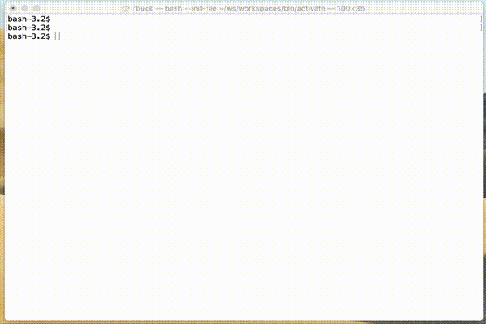

# `ws` – Interactively Manage Your Development Workspaces

Workspace management: no subshells, no profile setup, **simply extensible**.

(Note: `ws` is not supported natively on Windows.)

- [`ws` – Interactively Manage Your Development Workspaces](#ws-%e2%80%93-interactively-manage-your-development-workspaces)
    - [Installation](#installation)
        - [Third Party Installers](#third-party-installers)
    - [Creating Workspaces](#creating-workspaces)
    - [Removing Workspaces](#removing-workspaces)
    - [Removing Versions](#removing-versions)
    - [Miscellaneous](#miscellaneous)
    - [Optional Environment Variables](#optional-environment-variables)

## Installation

The easiest way to install `ws` is through the web:

    curl -L https://git.io/ws-install | bash

Once installed, `ws` creates workspaces in subdirectory `ws/workspaces` of the directory specified in environment variable `WS_PREFIX`, which defaults to `$HOME/ws`.

-----

Alternatively, you can clone this repo and

    make install

to install `ws` to `bin/ws` of the directory specified in the environment variable `$PREFIX`, which defaults to `$HOME/ws`. To install `ws` in a custom location (such as `$CUSTOM_LOCATION/bin/ws`), run `PREFIX=$CUSTOM_LOCATION make install`.

### Third Party Installers

On Linux and macOS, [ws-install](https://github.com/continuul/ws-install) allows installation directly from GitHub; for instance:

    curl -L https://raw.githubusercontent.com/continuul/ws-install/master/bin/ws-install | bash

ws-install sets `WS_PREFIX` to `$HOME/ws`, installs `ws` to `$HOME/ws/bin`, modifies the initialization files of supported shells to export `WS_PREFIX` and add `$HOME/ws/bin` to the `PATH`.

## Creating Workspaces

Simply execute `ws <workspace>` to create a workspace of the specified name. If `<workspace>` has already been created, `ws` will set it as the active workspace.

    ws buffalo
    ws cheetah
    ws dolphin

Execute `ws` on its own to view your workspaces, and select the desired workspace.

    $ ws

      buffalo
    ο cheetah
      dolphin

    Use up/down arrow keys to select a workspace, return key to install, d to delete, q to quit

(You can also use `j` and `k` to navigate up or down without using arrows.)

If the active workspace does not change after install, try opening a new shell in case seeing a stale workspace.

## Removing Workspaces

Remove some cached versions:

    ws rm buffalo

Removing all local workspaces except the current workspace:

    ws prune

Remove the installed node and npm (does not affect the cached version). This can be useful
to revert to the system version of node (if in a different location), or if you no longer
wish to use node and npm, or are switching to a different way of managing them.

    ws uninstall

## Miscellaneous

Command line help can be obtained from `ws --help`.

List local workspaces:

    ws ls

Display diagnostics to help resolve problems:

    ws doctor

## Optional Environment Variables

The `ws` command creates workspaces in `$HOME/ws` by default, but you may override this location by defining `WS_PREFIX`.
To change the location to say `$HOME/.ws`, add lines like the following to your shell initialization file:

    export WS_PREFIX=$HOME/.ws
    export PATH=$WS_PREFIX/bin:$PATH
